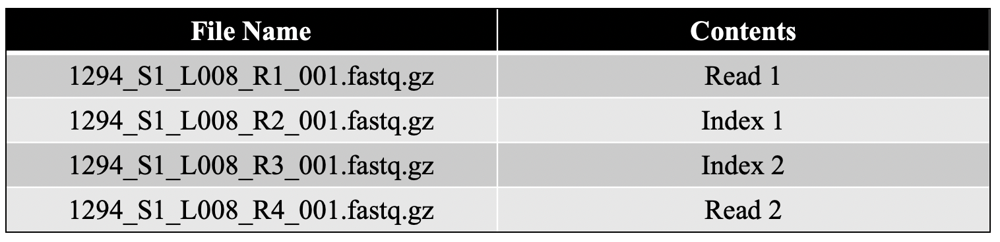
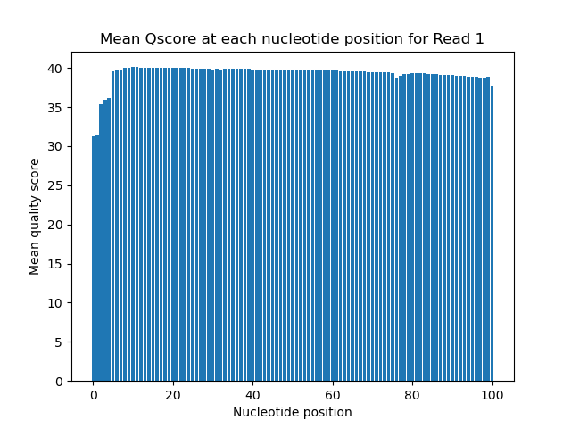
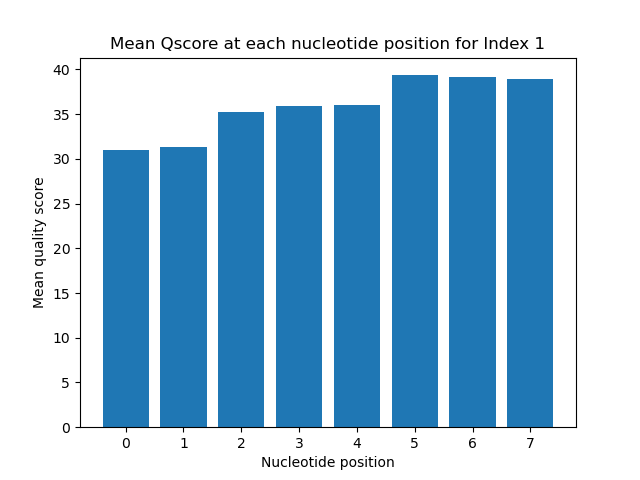
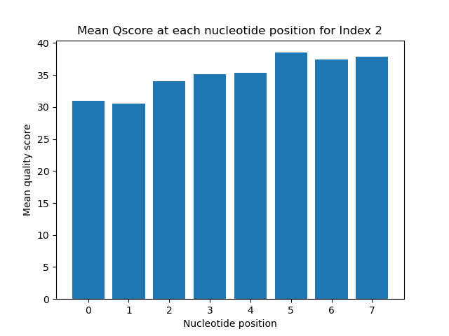
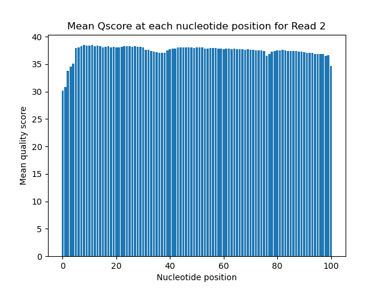

# Assignment the First

## Part 1
1. Be sure to upload your Python script.

2. Per-base NT distribution

## Questions from p.1

2. A decent cut-off for read pairs would be an average qscore of Q30 among all
of the positions in the read. This corresponds to 99% base call accuracy,
and seem to be the accepted cut-off for many applications.

For indices, it would be beneficial to have a more strict cut-off. This is because
the accuracy of a single base is much more heavily weighted in terms of index 
identification. When there are only 8 nucleotides, it's very important to have them
all correct, especially since they determine the identity of the reads. So, rather than an
average score of Q30, I would say that each of the nucleotides must be at least Q30. If a 
single nucleotide in the index is below Q30, parse out the entire index and associated reads.

3. single line command:

$ ls -1 1294_S1_L008_R2_001.fastq.gz 1294_S1_L008_R3_001.fastq.gz | while read fqfile; do zcat $fqfile | grep -A 1 "^@" | grep -v "^@" | grep -v "^--" | grep -c "N"; done

output:

3976613 (for index 1 file (R2))
3328051 (for index 2 file (R3))

total = 7304664 indices containing an unknown base between both index files 

## Part 2
1. Define the problem

The goal is to demultiplex paired-end sequencing data. Multiple libraries were
pooled and sequenced in parallel, so indices were used to distinguish which reads
came from which samples. Because this is paired-end data, each insert was read twice
from different directions, and therefore has two indices. In this case, dual matched
indices were used, so if everything went correctly, the two paired reads should have
the same index (although one will be the reverse complement, which must be accounted for).
If two corresponding records have different indices, this suggests they underwent index
hopping and must be parsed out of the analysis. The same goes for indices that are low
quality or contain unnkown bases. 

• This is all also in my psuedocode script

Five input files:

• R1: contains 'forward' read of insert reverse complement
• R2: index 1 reverse complement
• R3: index 2 original sequence
• R4: contains 'reverse' read of insert original sequence
• indices file: a plain text file containing the 24 unique 8 nucleotide indices

Records between files correspond with each other
(record 1 of R2 is the index for record 1 of R1 and so on)

The goal is to parse these into separate files:

2. Describe output

48 files containing records with a matching duel index (forward and reverse in separate files)

one file with all records with unmatched indices (index hopped)

one file with all records with at least one index that is low quality or containing an uncalled base (N)

this script will also output one additional file with the following statistics:
    - Number of read pairs with matched indices per index pair
    - Number of index hopped read pairs
    - Number of read pairs with at least one unknown index
    - Number of read pairs for every combination of viable index pairs

3. Upload your [4 input FASTQ files](../TEST-input_FASTQ) and your [4 expected output FASTQ files](../TEST-output_FASTQ).
4. Pseudocode
5. High level functions. For each function, be sure to include:
    1. Description/doc string
    2. Function headers (name and parameters)
    3. Test examples for individual functions
    4. Return statement
